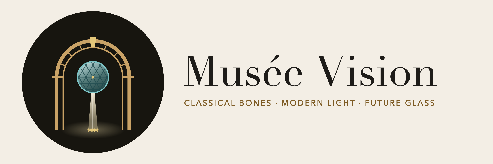

# Musée Vision · iPhone



The whole of Musée Vision as a walk-through on iPhone, built from the plan on the design canvas
(https://claude.ai/artifact/5KS3Zkfoub5zBdopET1Qc6). The long-term target is visionOS 27 on
Apple Vision Pro. The canvas is the design record; `plan/` holds a snapshot of it (the boards and the
illustrated guide PDF). When a board changes, refresh `plan/`, then update the numbers in
`Shared/Plan/` and the wing files in `Shared/Wings/`.

A Windows desktop version for an RTX 4090 is planned from this same repository: see
[`WINDOWS.md`](WINDOWS.md).

Everything is built in code (SwiftUI + RealityKit): no 3D assets except the open sculpture scans.

## The museum, as built

| Where | What you'll find | Board |
|---|---|---|
| **The Rotunda** (start) | You stand on the gilt sun at the centre of a Ø 20 m drum under a coffered dome and a steel-and-glass eye. The bronze sun clock keeps your local time (an idealised sun, 15° an hour). Four open doors. | Rotunda |
| **Salon Impression** (west) | Five skylit bays, the Manet cabinet, 37 works; the Nymphéas oval with the Water Lilies and the lily pond. | Salon, SalonPlan, SalonHang, SalonDetails |
| **The pond and the Reserve** | Tap the golden lily: a line of light runs round the rim. Tap it again: the whole pond lifts 2.6 m on four bronze posts. Walk under it and down the 36-step stair to the Reserve: 60 m of brick vaults, 56 brass racks. Tap a rack to glide it out; tap a painting to send it to the viewing easel. The pond settles again once you leave the oval (or tap the lily from beside it). | SalonReserve |
| **Sculpture Hall** (north) | A top-lit court, 16.8 m square: ten works from open 3D scans, with The Gates of Hell closing the axis 30 m from the sun. | Sculpture |
| **The Chinese Wing** (south) | The solar-term stele, the moon gate, the moon terrace, a cloister round the Garden of the Four Seasons: ceramics (the chicken cup is the one you may hold: tap it), six hanging scrolls, and the 11.9 m Thousand Li handscroll, which opens an arm's length at a time as you walk north beside it. The garden follows today's solar term; at night the real moon lies in the pond. | ChineseWing |
| **The Hall of Light** (east) | 30 m of glass under a lattice vault, between a birch meadow and an orchard that follow the season. Twenty photographs, walking forward in time; four stereo stones whose stereographs rock gently to show their depth. | HallOfLight |
| **Élan: the Atrium** | A 28 m circle of twelve bays under misty glass. The Starry Night on its glass stele marks the car. Stand on the bronze ring and tap **Call the car**: it glows down through the misty glass (the wait is part of the visit). | FutureAtrium |
| **Élan: the Square** (−9 m) | Down to the earth first: rammed earth, the Lo Shu's nine squares with bronze numerals, four dark rooms, the strata under the glass floor. | ElanSquare |
| **Élan: the Sphere** (+101 m) | Then up to the stars: a steady 1.5 m/s for about 70 seconds, up the bronze mast to the exact centre of Boullée's 150 m shell. The glass dims to a rail and a floor, and the real sky over you, now, surrounds you, below your feet too. | ElanSphere |

## Controls (iPhone)

- **Walk:** joystick, bottom left. Walls, stairs and furniture are solid; the elevator and the lifting pond carry you.
- **Look:** drag anywhere else.
- **Tap** a work for its glass placard (title, artist, date, collection), or a thing to use it: the golden lily, a rack in the Reserve, a painting on a rack, the chicken cup, the elevator car.
- **Buttons** appear when there's something to do where you stand (call the car, choose a floor).
- On first launch the app asks for your **approximate location**, only to show the real sky, sun and moon over you (the Rotunda's clock uses local time either way). Without it the sky is guessed from your time zone.

No map and no viewing-stone glide (your choices for the phone).

## Build and run

Open `MuseeVision.xcodeproj` in Xcode-beta (Xcode 27) and press Run, or from the command line:

```bash
DEVELOPER_DIR=/Applications/Xcode-beta.app/Contents/Developer xcodebuild -project MuseeVision.xcodeproj -scheme MuseeVision -sdk iphonesimulator -destination 'platform=iOS Simulator,name=iPhone 16' build
```

The deployment target is iOS 18.0. Paintings stream in and out with distance to keep memory down on
the phone. Debug builds accept launch arguments for testing: `-pose "x z yaw pitch [feet]"`, and
`-do "step@seconds;…"` with steps such as `lily`, `elevator.call`, `elevator.square`,
`elevator.sphere`, `rack.C`, `easel.<work-id>`, `walk:seconds:jx:jy`, `turn:degrees`, `log`.

## The logo

The logo was designed for the museum from the canvas's own language. It shows a classical arch (the
bones) framing a lattice oculus (the future glass), from which a slit of light (the modern light) falls
onto the gilt sun where every visit begins. The oculus also reads as the Sphere at the top of the visit.
Gilt `#C9A266`, oculus glass `#7CC3C5` and travertine `#F1EBDF` sit on dark bronze `#17150F`, with
Didot for the wordmark. The app icon has light, dark and tinted variants; lockups are in `assets/logo/`.

## Code layout

| Folder | Contents |
|---|---|
| `Shared/Core/` | Mesh kit (walls with arched, flat and round openings; domes, vaults, lathes, ribbons), materials, Core Graphics textures, collision and floors (multi-level), sculpture scans, gardens, the sky (ephemerides for sun and moon, the 24 solar terms, the star catalogue). |
| `Shared/Plan/` | Numbers from the boards: the Salon plan and hang, the Hall of Light planting. |
| `Shared/Wings/` | One file per wing: Rotunda, Salon (with the cabinet and oval), Reserve (pond, stair, racks, easel), SculptureHall, ChineseWing, HallOfLight, Elan (Atrium, Square, elevator), SkyDome. |
| `Shared/MuseumScene.swift` | Builds everything and runs the moving parts; platform-neutral for a future visionOS target. |
| `iOS/` | RealityView, walking, multitouch, placards, buttons, location. |
| `data/` | The painting and sculpture catalogues (`artworks.json`, `sculptures.json`). |
| `plan/` | Snapshot of the design canvas: the boards and `Musee-Vision-Guide.pdf`. |
| `assets/` | `paintings/` (images + CREDITS.md), `sculptures/` (scans + CREDITS.md), `sky/` (stars), `logo/`, `collection.json` (placards for the other wings' works), `reference/` (glaze colours, not bundled). |

World coordinates follow the boards: metres, Rotunda centre = origin, x east, plan y south (RealityKit z),
height up.

## Where the plan was read, resolved or bent

The rule was to follow the plan exactly, and where something isn't feasible, note it and use judgement.
Earlier readings (Salon wall height, skylight width, the eye, the Manet cabinet's side walls, the oval
size, the Water Lilies panel lengths) still stand; see the notes below the tables.

### Not feasible as drawn, and what I did

| Item | Why | What the app does |
|---|---|---|
| The Sphere, 150 m across, centred 101 m over the Atrium | At true scale it would loom over the Hall of Light, the gardens and the Rotunda's eye, but the board says it is "never seen". | Not rendered from outside. Once the car passes the south pole (26 m), the building is hidden and you are in the sky. |
| "The real sky over your location" | Needs your location. | Asks for approximate location (reduced accuracy). If refused, uses your time zone. Stars are the 9,096 naked-eye stars of the Yale Bright Star Catalogue. |
| The moon lying in the Chinese pond | With exact physics the Taihu rock and the south wall hide the reflection most of the night. | Drawn as seen from where you stand whenever the moon is up at night (the poetic option on the board). |
| Gaze-and-pinch (the golden lily, racks, the car) | Vision Pro gestures. | Tap. The lily needs two taps (wake, then lift), keeping the board's two-step cue. |
| Holding the chicken cup | No hands on a phone. | Tap it and it floats into your hand, turning slowly; tap again to put it back. |
| Stereographs "in 3D" | No stereo display on a phone. | The left and right views alternate four times a second, so the depth shows as a gentle rocking. |
| "No skip" elevator | — | Honoured: rides run in real time at 1.5 m/s with soft starts (Atrium to centre ≈ 69 s). The first ride from the Atrium goes down to the Square first. |
| The Sphere's opening piece ("the sky becomes The Starry Night") | Marked "proposed" on the board. | Not built; the live sky is shown. |
| Sculpture scans from Sketchfab | Downloads need an account. | The same CC-BY/CC0 scans were taken from Objaverse, the Allen Institute's open copy of Sketchfab's CC models, and Wikimedia Commons. The Cleveland CC0 Age of Bronze isn't in it, so the CC0 Stockholm cast is used. See `assets/sculptures/CREDITS.md`. |
| The Tang sancai horse | No open museum scan exists. | An unprovenanced CC-BY Tang-style horse scan, glazed amber; marked as a stand-in in the credits. |

### Conflicts between boards, and the reading used

- **Rotunda pilasters vs the 4 m N/S doors:** the plan's pilasters stand 0.54 m into each opening. Kept as drawn; they frame the doors, clear width ≈ 2.9 m.
- **The Rotunda's niches:** labelled "NICHE · SCULPTURE" with no work named. They are left empty.
- **Rotunda S door vs the vestibule's 4.4 m ceiling:** a plaster panel closes the arch above the vestibule ceiling.
- **Chinese Wing:**
  - The perspective view is mirrored; the plan is used. So are the south-wall elevation's order (7 west → 12 east) and the plaque, which reads right to left with 四 on the west.
  - The first seat-rail bay is left open where the drawn route crosses it.
  - The SE bamboo clump is moved 0.5 m north-west so it clears the eaves.
  - Orchids and chrysanthemums, which the plan doesn't place, stand in pots by the bamboo beds.
  - The garden's 18 undrawn solar terms are interpolated.
- **Hall of Light:**
  - It ends at the Atrium's 0.8 m wall (x 39.9), so bay 10's prints move to x 38.95.
  - The Atrium door is 4.0 × 4.5 m, flat-headed, from the perspective.
  - The hedges are 1.5 m tall (not drawn).
  - Nadar hangs in bay 4 and Muybridge in bay 6 (north wall). The 12 unnamed bays and the four autochrome plates are filled with landmark photographs of their years (listed in `assets/paintings/CREDITS.md`).
- **Élan:**
  - The car waits in the throat at 22 m when idle, so a call brings it down in about 16 s.
  - A glass landing screen stands round the shaft at the Atrium and the Square.
  - The car floor stops at 99.4 m so your eyes are at the centre.
  - The ribs follow the half-section's curves, not the small section's straight lines.
  - The Square's dark-room doors are 2.6 × 3.0 m.
- **Sculpture Hall:**
  - The roof is a glass pyramid over the laylight; only the laylight is seen from inside.
  - Works that aren't drawn facing anything face the axis.
  - Hercules moves 0.3 m east so his bow can't enter the view from the sun to the Gates.
  - Plinth heights missing from the plan are 1.3 / 0.3 / 0.5 m.
- **The Reserve:**
  - The floor opening is the pond's footprint over the 2.4 m shaft, with the stair descending east.
  - The two plan chests stand where drawn, so the two empty south racks under them are dropped: **56 racks, not 58**.
  - The vault is the union of cross barrels and an aisle barrel, which gives at least 3 m of aisle headroom.
  - One rack is out at a time.
  - Timings are not given on the board: lift 5 s, rack 1.5 s, carry to the easel 6 s.
- **Earlier Salon notes (still valid):**
  - Olympia is on the cabinet's east wall and the Bar on its west, following the plan's data after the flip.
  - Walls are 6.5 m, skylight openings 3 m wide, the eye Ø 5 m, and the oval 22.0 × 15.0 m inside.
  - The Water Lilies hang at their true proportions (Morning squeezed about 10% to fit its arc).
  - Rouen #5 is the Orsay's *Harmonie blanche*.

## Images, scans and data

- **Paintings, photographs, scrolls:** `assets/paintings/CREDITS.md` gives the source URL and licence for every file. They are mostly museum open access (Met, AIC, NGA) or public-domain scans on Wikimedia Commons. A few gallery photos are CC BY or CC BY-SA and need attribution if shared.
- **Sculpture scans:** `assets/sculptures/CREDITS.md`; all CC BY or CC0, decimated to at most 150k triangles, untextured (bronze, marble and stone materials).
- **Stars:** `assets/sky/CREDITS.md` (Yale Bright Star Catalogue, CDS V/50).
- **Placards:** `data/artworks.json` and `data/sculptures.json` (bundled as-is), plus `assets/collection.json` for the Chinese Wing, the Hall of Light and The Starry Night.
